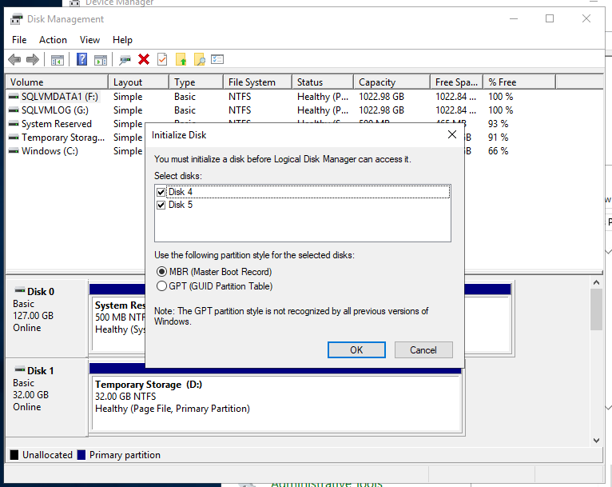
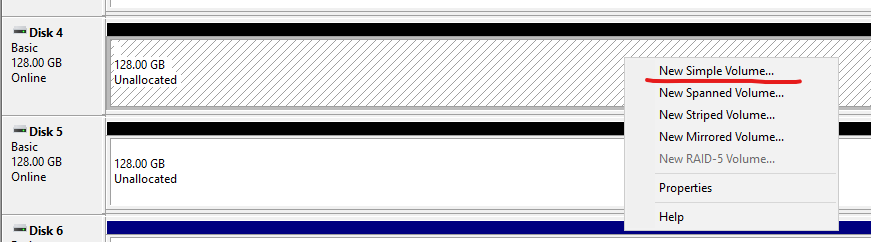

# Decrease Azure VM disk size

Step 1 Create a new disk

Step 2 Remote onto the machine and attach the new disk using Disk Management (right-click on Windows button in the bottom-left corner)

Step 3 Copy everything from the old disk to the new disk, using robocopy

Step 4 Delete the old volume in Disk Manager

Step 5 Remove disk in Azure

Step 6 Change drive letter
